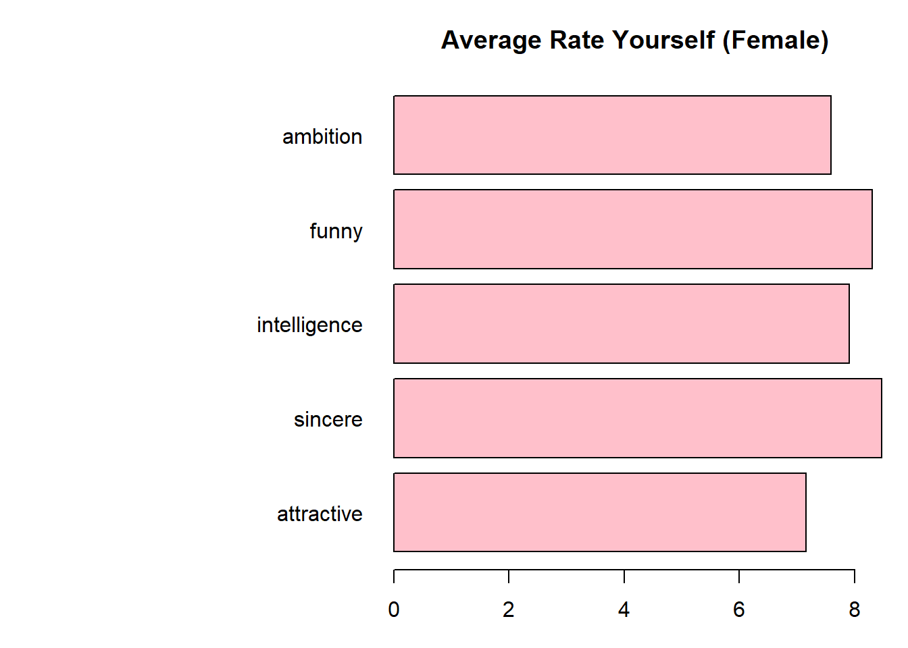

Speed Dating Data Exploration
================
April 18, 2019

<!-- README.md is generated from README.Rmd. Please edit that file -->
This data set was created and generated by Raymond Fisman, Sheena S. Iyengar, Emir Kamenica and Itamar Simonson from the University of Columbia School of Business in 2002-2004. They used this data to for their research paper called, "Gender Differences in Mate Selection: Evidence From a Speed Dating Experiment." The original purpose of the research was to analyze gender differences in dating preferences. They wanted to study dating behavior using an experimental speed dating market and serve as a starting point in understanding the thought process of selecting a mate. Everyone participating in the speed dating experiment get matched into pairs; male and female. they have a short, 4 minute conversation to make a good first impression. After each interaction, participants were asked to fill out a scorecard about what they thought about their potential partner. After cycling around everyone, each participant are asked who they want to date. If both feel the same way then their is match, but if either person says no then their is no match.

Load Packages

``` r
library(magrittr)
library(dplyr)
library(ggplot2)
library(GGally)
library(cowplot)
library(GGally)
library(treemap)
library(data.table)
library(corrplot)
library(caret)
library(randomForest)
library(e1071)
library(gbm)
library(glmnet)
library(MASS)
library(klaR)
library(qcc)
library(colorspace)
library(ModelMetrics)
library(kableExtra)
```

To begin our analysis, We have 2 defined groups: male and female. lets remove irrelevant columns or redundant columns based on the knowledge of the data. After spiting the data to male and female Let's split the data into groups who managed to get a date and did not get a date.

Since there are so many variables, it would be too lengthy to summarize all of them, so I will present the most interesting or relevant to this analysis.


The bar plot shows European/Caucasian-Americans are over represented in this data so their preferences and values might dominate certain attribute statistics. Most people in the data set were in there 20s-30s.


It appears that males feel that ambition is not an important attribute when looking for a partner while the over attributes are more diverse (funny not so much).

For females, most do not put importance on any one attribute, but women who placed higher importance on appearance were more likely to get a date.


This seems like people are undervaluing their own attributes but overall there does not seem to be anything discernable from these parallel coordinate plots. This shows there is no importance placed on any one attribute. Below we will use bar charts to make this more distinct.



Again not nothing special sticks out, other than males valuing appearance than any category while women value intelligence the most. The hobbies chart between the two gender have some slimilarities.


Here we can see that for males, business students were over represented in the speed dating experiment. The female major distribution is more diverse.

Here is a correlation matrix between the numeric variables (only upper triangular matrix is shown for brevity). though not particularly useful with so much variables. There does not seem to be any variables that are significantly correlated with one another.


How many got a chance at a date?


    ##   Male Female
    ## 0 2146   2222
    ## 1  409    456

Less than 20% of participants got a date.

Both are very similar but there is a slightly higher chance to get a date if you are a female. But Overall it is difficult to discern any meaningful conclusion based on looking at the data since everyone has different tastes and expectations and those may change again whenever you meet someone different; some maybe more accepting of your preferences and some may not.
